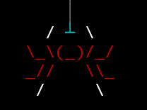
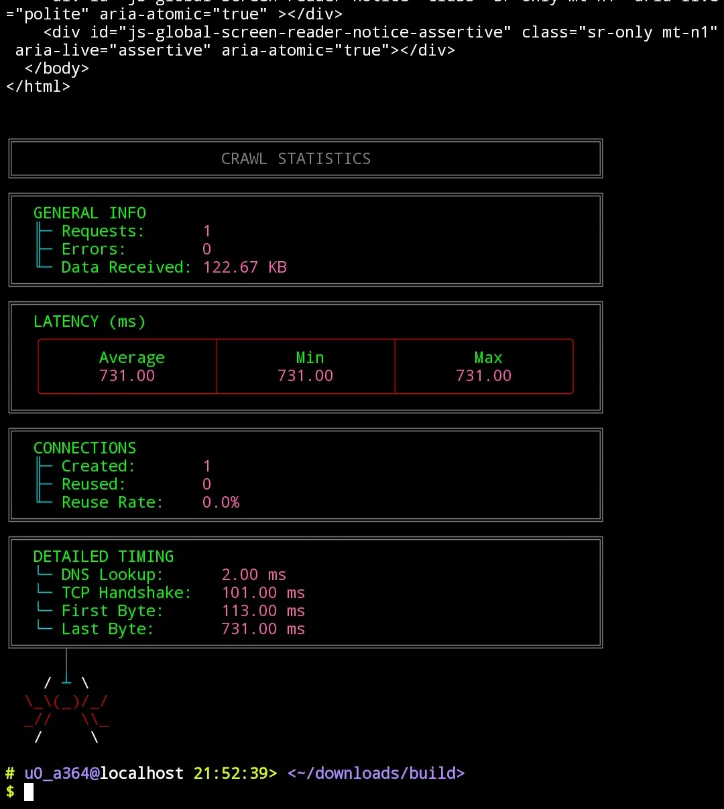

# crawl

```
 ██████╗██████╗  █████╗ ██╗    ██╗██╗
██╔════╝██╔══██╗██╔══██╗██║    ██║██║
██║     ██████╔╝███████║██║ █╗ ██║██║
██║     ██╔══██╗██╔══██║██║███╗██║██║
╚██████╗██║  ██║██║  ██║╚███╔███╔╝███████╗
 ╚═════╝╚═╝  ╚═╝╚═╝  ╚═╝ ╚══╝╚══╝ ╚══════╝
```

> A fast, modern, and beautiful HTTP client for the terminal — written in C++.

---



---





## Usage

```
crawl [options] <URL>
```

---

## Features

### ⚡ Performance

**Parallel segmented downloads (`-p`, `-P <num>`)**
Splits a file into N segments and downloads them simultaneously using HTTP `Range` requests, then reassembles the pieces in order. Falls back gracefully to single-threaded mode if the server doesn't support `Accept-Ranges`. Default pipe count is 10.

**HTTP/2 support (`-2`, `--http2`)**
Prefers HTTP/2 connections when the server supports it, enabling multiplexed streams, header compression, and reduced latency over a single connection. HTTP/2 negotiated via ALPN during TLS handshake.

**Connection pooling**
Maintains a pool of keep-alive connections (up to a configurable maximum) per `host:port:tls` combination. Idle connections are automatically cleaned up after a configurable timeout, so you pay the TCP and TLS handshake cost only once per host.

**DNS caching (`-D`, `--dns-cache`)**
Caches DNS resolutions in-memory with a configurable TTL (default 5 minutes). Tracks hits and misses internally. Repeat requests to the same host skip the resolver entirely.

**DNS pre-warming (`--warmup <host>`)**
Proactively resolves and caches a host's DNS records before the first real request, eliminating cold-start latency.

**Happy Eyeballs v2 (RFC 8305)**
When connecting to a host, crawl races IPv4 and IPv6 connection attempts in parallel with staggered delays (250 ms between attempts, 50 ms resolution delay) and uses whichever socket connects first. This means faster connections on dual-stack networks without any manual configuration.

**Transparent compression (`-C` to disable)**
Automatically advertises `Accept-Encoding: gzip, deflate, br` and decompresses responses on the fly. Supports **gzip**, **deflate**, and **Brotli** (when compiled with zlib/brotli). Compression can be disabled with `--no-compress`.

**Rate limiting (`-R`, `--rate-limit <rps>`)**
Token-bucket rate limiter that caps outgoing requests to a specified number per second, with configurable burst capacity. Both blocking (`acquire()`) and non-blocking (`try_acquire()`) modes are available internally.

**Batch mode (`-B`, `--batch <file>`)**
Reads a list of URLs from a file and executes all of them in parallel (controlled by `-P`), making crawl suitable for bulk scraping or testing scenarios.

**Configurable max connections (`--max-conn <num>`)**
Sets the ceiling on how many concurrent connections the pool may hold, giving fine-grained control over resource usage.

---

### 🔧 Request Control

**HTTP method selection (`-X`, `--request <method>`)**
Supports any HTTP verb: `GET`, `POST`, `PUT`, `DELETE`, `PATCH`, `HEAD`, `OPTIONS`, etc.

**Custom headers (`-H`, `--header <header>`)**
Add arbitrary request headers, repeatable as many times as needed.

**POST body (`-d`, `--data <data>`)**
Send an HTTP request body with any method.

**Custom User-Agent (`-A`, `--user-agent <ua>`)**
Override the default `User-Agent` string.

**Redirect following (`-L`, `--location`)**
Follow HTTP redirects automatically (off by default), up to a configurable maximum depth of 10.

**Timeout control (`-m`, `--max-time <sec>`)**
Set a maximum total time for the request (default: 30 seconds).

**Retry logic (`-r`, `--retry <count>`)**
Automatically retry failed requests up to N times, with exponential backoff and a configurable base delay between attempts.

---

### 📊 Visibility & Output

**Colorized progress bar (`-p`, `--progress`)**
A live, terminal-width-aware progress bar rendered to `stderr` that shows:
- A fluorescent-green filled segment for bytes downloaded
- A red dashed unfilled segment for remaining bytes
- Percentage complete in pink
- Current / total in human-readable units (B, KB, MB, GB) in orange
- A friendly "content length not provided by site" message centered in the bar when the server omits `Content-Length`

The bar updates at 100 ms intervals on a dedicated background thread and clears itself cleanly on completion.

**Detailed statistics (`-S`, `--stats`)**
After a request (or batch), prints a rich, box-drawn statistics panel including:
- **General info** — request count, error count, total data received
- **Latency** — average, min, and max response time in milliseconds
- **Connections** — created vs. reused, connection reuse rate
- **Detailed timing breakdown** — DNS lookup, TCP handshake, time to first byte, time to last byte

**Verbose output (`-v`, `--verbose`)**
Includes response headers alongside the body output.

**Include headers in output (`-i`, `--include`)**
Prepend response headers to the written output.

**JSON output (`-J`, `--json`)**
Formats the response as a JSON object for easy downstream processing.

**File output (`-o`, `--output <file>`)**
Write the response body to a file instead of stdout.

---

### 🔒 TLS & Security

Crawl establishes TLS connections natively using the system's TLS library. Secure and plain connections are handled transparently based on the URL scheme (`https://` vs `http://`). TLS state is pooled alongside sockets so TLS sessions benefit from connection reuse.

---

### 🎨 Aesthetics

crawl greets you with a large ASCII-art banner and a custom spider mascot. All terminal output uses a carefully chosen ANSI color palette — cyan, fluorescent green, pink, orange, red, and grey — applied consistently across the progress bar, statistics panels, and help text, giving the tool a distinctive and readable look even in long terminal sessions.

---

## Examples

```bash
# Simple GET
crawl https://example.com

# Follow redirects with verbose timing
crawl -v -L https://google.com

# POST with JSON body
crawl -X POST -H "Content-Type: application/json" -d '{"key":"value"}' https://api.example.com

# Download a large file with 8 parallel pipes and a progress bar
crawl -p -P 8 -o file.zip https://example.com/large.zip

# Batch download with stats
crawl -B urls.txt -P 20 -S

# Pre-warm DNS, then fetch with stats
crawl --warmup example.com -S https://example.com
```

---

## Dependencies

### ✅ Required

| Dependency | Purpose | Ubuntu/Debian | Arch | Fedora/RHEL |
|---|---|---|---|---|
| **C++20 compiler** | Build toolchain | `g++` or `clang++` | `gcc` | `gcc-c++` |
| **CMake ≥ 3.15** | Build system | `cmake` | `cmake` | `cmake` |
| **make** | Build runner | `make` | `make` | `make` |
| **pthreads** | Threading | *(included with gcc)* | *(included)* | *(included)* |
| **mbedTLS** | TLS/HTTPS support | `libmbedtls-dev` | `mbedtls` | `mbedtls-devel` |
| **git** | Auto-fetch mbedTLS if not installed | `git` | `git` | `git` |

> **Note:** If `mbedTLS` is not found on your system, CMake will automatically clone and build it from source (v3.6.2) via `FetchContent` — just make sure `git` is available and you have an internet connection during the first build.

### ⚙️ Optional (strongly recommended — each unlocks a feature)

| Dependency | Feature unlocked | Ubuntu/Debian | Arch | Fedora/RHEL |
|---|---|---|---|---|
| **zlib** | gzip & deflate decompression | `zlib1g-dev` | `zlib` | `zlib-devel` |
| **libbrotli** | Brotli decompression | `libbrotli-dev` | `brotli` | `brotli-devel` |
| **nghttp2** | HTTP/2 support | `libnghttp2-dev` | `nghttp2` | `libnghttp2-devel` |

Optional libraries are detected automatically at configure time — no CMake flags needed. Any that are missing will simply have their feature silently disabled.

### One-liner installs

**Ubuntu / Debian**
```bash
sudo apt install -y build-essential cmake git libmbedtls-dev zlib1g-dev libbrotli-dev libnghttp2-dev
```

**Arch Linux**
```bash
sudo pacman -S --needed base-devel cmake git mbedtls zlib brotli nghttp2
```

**Fedora / RHEL**
```bash
sudo dnf install -y gcc-c++ cmake git mbedtls-devel zlib-devel brotli-devel libnghttp2-devel
```

---

## Building

```bash
./build.sh            # Release build (default)
./build.sh --debug    # Debug build
./build.sh --clean    # Clean then rebuild
```

CMake is used as the build system with ultra-aggressive optimizations enabled in Release mode (`-O3 -ffast-math -march=native -flto`). Link Time Optimization (LTO) is automatically enabled when supported. Profile-Guided Optimization (PGO) is also available:

```bash
# Step 1 — instrument the binary and run your typical workload
./build.sh --pgo-gen
./build/crawl https://example.com

# Step 2 — rebuild using the collected profile data
./build.sh --pgo-use
```

---

## License

This project is licensed under the **Apache License 2.0**. See the [LICENSE](LICENSE) file for the full text.

Copyright © 2026 itz-ender / itzender5820


```
‎      │
    / ┴ \
  \_\(_)/_/
  _//   \\_
   /     \
```
